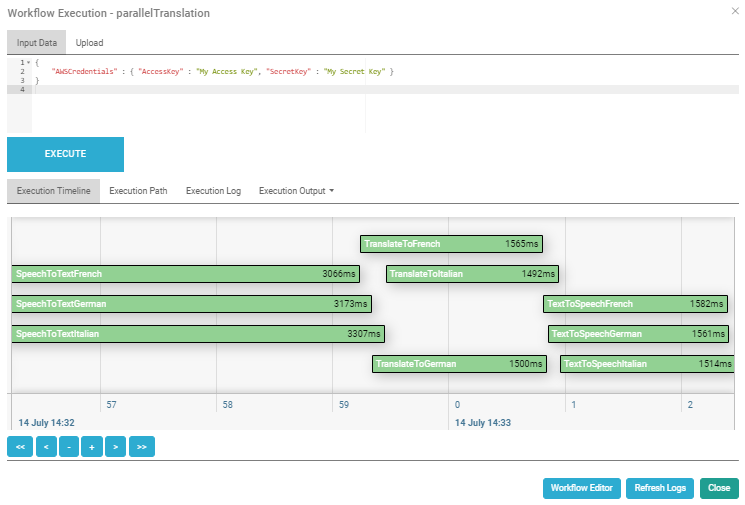

# How to Port an AWS Serverless App to KNIX MicroFunctions

In my last [article](https://github.com/abeckn/serverless-apps/tree/master/speech-to-speech-translation/) I described the implementation of a serverless speech-to-speech language translation app using AWS Lambda and Step Functions. In this article I will describe how to port that same app to [KNIX MicroFunctions](https://knix.io).

## KNIX MicroFunctions

[KNIX MicroFunctions](https://knix.io) is a new serverless platform originally developed by [Nokia Bell Labs](https://bell-labs.com). It has since been open sourced on [GitHub](https://github.com/knix-microfunctions/knix). (Full disclosure: I am part of the team that developed KNIX.)

KNIX minimizes startup delays for function executions, provides support for persistent functions and optimizes resource utilization. It is AWS-compatible but outperforms AWS Step Functions and Express workflows by a factor of 6 (as of June 2020).

KNIX runs on Kubernetes/Knative as well as on bare metal or VMs. At present, the KNIX platform supports the Python 3.6 and Java 8 runtimes. It also comes with developer tools such as a web IDE (shown below), SDK, and CLI. 


## KNIX Workflows

KNIX supports serverless workflows which are comparable to Amazon's Step Functions. You can use them to create a serverless app that consists of multiple functions. In my AWS Lambda implementation of the translation app I had used the Amazon States Language (ASL) to define a state machine for my app. KNIX also supports ASL along with some KNIX-specific extensions (e.g., for long-running session functions). As such, I could simply copy my ASL definition from the AWS console and paste it into the KNIX workflow editor. The only change I had to make was to replace the ARN identifiers in the `Resource` fields with the corresponding KNIX function names. 

The KNIX workflow editor has a built-in visualization tool which produced the following visualization for my workflow:


As you can see in the adapted ASL definition below (only the first branch is shown) the only change I had to make was to remove the ARN-specific parts from the `Resource` fields since I kept the function names the same in KNIX. 

```json
{
    "Comment": "Parallelized Language Translation",
    "StartAt": "ParallelTranslator",
    "States": {
        "ParallelTranslator": {
            "Type": "Parallel",
            "End": true,
            "Branches": [
                {
                    "StartAt": "Italian",
                    "States": {
                        "Italian": {
                            "Type": "Pass",
                            "Result": {
                                "TargetLanguageCode": "it",
                                "VoiceId": "Carla"
                            },
                            "ResultPath": "$.TargetLanguage",
                            "Next": "SpeechToTextItalian"
                        },
                        "SpeechToTextItalian": {
                             "Type": "Task",
                             "Resource": "speech2text",
                             "Next": "TranslateToItalian"
                        },
                        "TranslateToItalian": {
                            "Type": "Task", 
                            "Resource": "translate",
                            "Next": "TextToSpeechItalian"
                        },
                        "TextToSpeechItalian": {
                            "Type": "Task",
                            "Resource": "tts",
                            "End": true
                        }

                    }
                },
                [...]
            ]
        }
    }
}
```

Instead of copying and pasting the ASL definition into the KNIX workflow editor I also could have uploaded a [file](https://github.com/abeckn/serverless-apps/raw/master/knix-speech-to-speech-translation/knix_speech_to_speech_translation.zip) containing the workflow JSON or used the KNIX workflow import tool in the GUI. The workflow import tool lets KNIX users upload a zip file containing the workflow JSON as well as all function code and any function code dependencies. The zip file must adhere to the following directory structure:

```ascii
 myWorkflow.json
            ├── myFunction1/
               ├── myFunction1.py|java
               ├── [requirements.txt]
               ├── [myDependency.py|java]
               ├── [otherDependencies/]
                    ├── [myOtherDependency.png]
            ├── [myFunction2/]
               ├── [myFunction2.py|java]
               ├── [requirements.txt]
               ├── [myDependency.py|java]
               ├── [otherDependencies/]
                    ├── [myOtherDependency.png]
            ...
```


In the following I will summarize any changes I hade to make to the AWS Lambda function code of my app to make it run on KNIX.

## speech2text Function

The 'speech2text' Lambda function reads the audio clip from the object store and sends it to IBM's Watson SpeechToText cloud service. I had to change the name of the method that gets called by the serverless platform when the function is invoked from `lambda_handler` to `handle`. Unlike in AWS Lambda, in KNIX the handler method to be invoked by the platform cannot be customized and must always be called `handle`. 

I also had to change my function code to use the KNIX object store instead of Amazon's S3 for storing the voice sample to be translated. The KNIX object store APIs are exposed through the `context` API object in the `handle` method. The KNIX object store operates on strings which means that binary data such as audio clips have to be base64-encoded. So I had to import the base64 library and add a line to base64-decode the audio recording after retrieving it from the KNIX object store. 

Unlike Step Functions, KNIX workflows cannot yet be triggered by object store operations, although this feature is currently under development. As such, I had to manually execute my KNIX workflow using the GUI after uploading the voice sample to the KNIX object store.


```python
import json
import base64
import requests
from requests.auth import HTTPBasicAuth

def handle(event, context):
    
    # get the recording
    recording = context.get("recording.mp3")
    
    # base64-decode recording
    recording = base64.b64decode(recording)
    
    url = "https://stream-fra.watsonplatform.net/speech-to-text/api/v1/recognize"
    
    # send audio to IBM Watson Speech-to-Text service
    response = requests.post(url=url, data=recording, auth=HTTPBasicAuth('apikey', [api_key]))
    
    transcript = response.json()['results'][0]['alternatives'][0]['transcript']
    
    return_json = {}
    return_json['SourceText'] = transcript
    return_json['TargetLanguage'] = event['TargetLanguage']
    return_json['AWSCredentials'] = event['AWSCredentials']
    
    return return_json
```

## translate Function

The 'translate' function translates the transcripts to one of three target languages. Aside from changing the handler method name, I had to make a slight change to the import statement for the 'requests' library, namely delete the AWS-specific 'botocore.vendored' part. I also had to add the 'boto3' library as a function requirement. KNIX requires that all non-standard libraries be listed in the 'Requirements' tab of the function editor (in the format of a pip `requirements.txt` file) as shown below.


Since we are now calling the Amazon Translate service from outside the AWS ecosystem, I also had to pass the access key and secret associated with my AWS account to the boto3 session object.


```python
import json
import boto3

def handle(event, context):
    source_text = event['SourceText']
    target_language_code = event['TargetLanguage']['TargetLanguageCode']
    target_language_voice_id  = event['TargetLanguage']['VoiceId']
    access_key = event['AWSCredentials']['AccessKey']
    secret_key = event['AWSCredentials']['SecretKey']
    
    # create boto3 session
    translate_client = boto3.Session(
        aws_access_key_id=access_key,
        aws_secret_access_key=secret_key,
        region_name='us-east-1').client('translate')

    # call AWS Translate
    result = translate_client.translate_text(Text=source_text,
             SourceLanguageCode="en", TargetLanguageCode=target_language_code)

    # create return value JSON object
    return_json = {}
    return_json['SourceText'] = event['SourceText']
    return_json['TranslatedText'] = result.get('TranslatedText')
    return_json['TargetLanguageCode'] = target_language_code + "-" + target_language_code.upper()
    return_json['AWSCredentials'] = event['AWSCredentials']
    return_json['VoiceId'] = target_language_voice_id

    return return_json
```

## tts Function

The 'tts' function sends the translation result to Amazon's text-to-speech service, 'Polly' and saves the returned mp3 audio data to the object store. I had to make the following changes in this function: 

* change the entry method name to 'handle'
* add 'boto3' to the list of requirements in the KNIX function editor
* initialize the boto3 session with the access key/secret associated with my AWS account
* save the resulting voice sample (after base64-encoding it) to the KNIX object store instead of S3 using the `context.put()` API


```python
import json
import base64
import boto3

def handle(event, context):

    source_text = event['SourceText']
    translated_text = event['TranslatedText']
    target_language_code = event['TargetLanguageCode']
    target_language_voice_id  = event['VoiceId']
    access_key = event['AWSCredentials']['AccessKey']
    secret_key = event['AWSCredentials']['SecretKey']

    polly_client = boto3.Session(
        aws_access_key_id=access_key,
        aws_secret_access_key=secret_key,
        region_name='us-east-1').client('polly')
       
    response = polly_client.synthesize_speech(VoiceId=target_language_voice_id,
                    OutputFormat='mp3', LanguageCode=target_language_code,
                    Text = translated_text)
    
    context.put(target_language_code + '.mp3', base64.b64encode(response['AudioStream'].read()).decode("utf-8"))
    
    return_json = { 'Translation' : translated_text }
    return return_json
```

## Workflow Execution

In order to test my speech-to-speech translation app under KNIX, I first uploaded my voice recording to the KNIX object store using the KNIX GUI. I then used the GUI to  deploy and execute my newly created workflow. The KNIX workflow execution dialog lets me specify the JSON-based workflow input (AWS credentials for my app) and visualizes the function execution on a timeline (see screenshot below). I can also view any log statements generated by my functions as well as the workflow output (in this case the translations in text form).



After my workflow execution finished successfully, I navigated to the object store interface from where I could download the speech translations generated by my app (see screenshot below).


## Closing

I hope this article has helped you get a better understanding of the KNIX MicroFunctions platform and how to move existing serverless apps from the AWS ecosystem to KNIX MicroFunctions.

You can find the complete source code for both the AWS Lambda as well as the KNIX versions of my speech-to-speech translation app in my [Github repo](https://github.com/abeckn/serverless-apps). 

