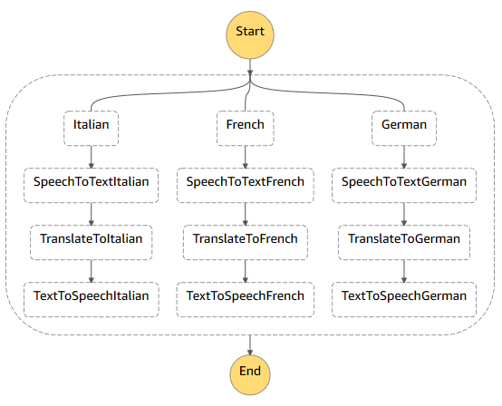
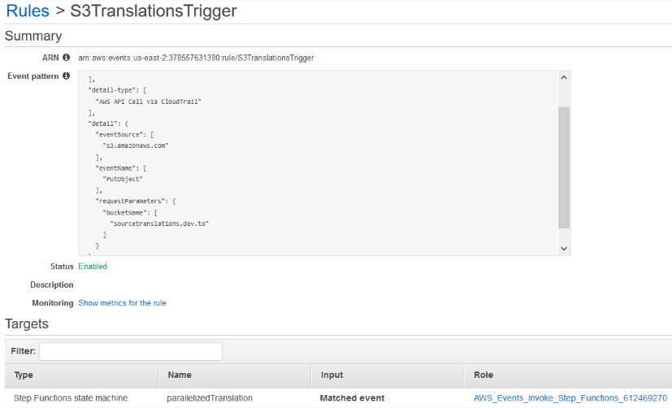
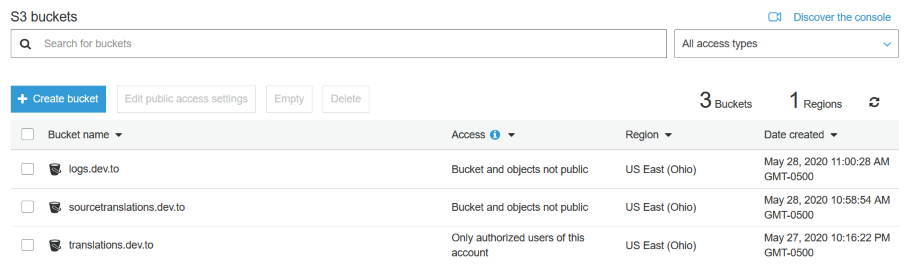
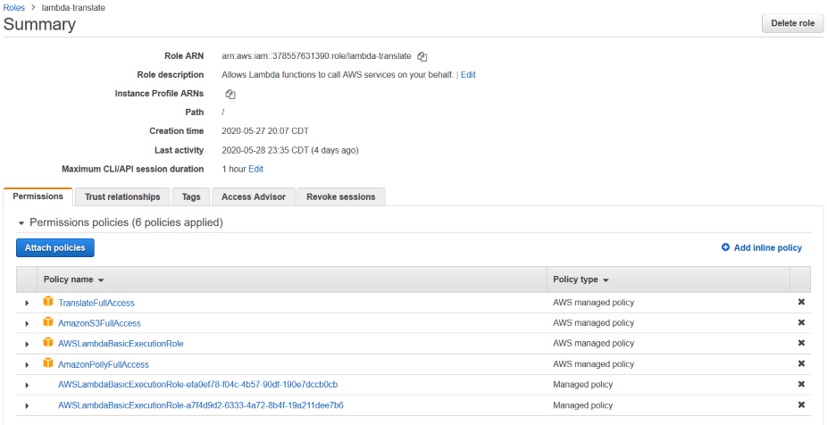

# Implementing a Serverless Speech-To-Speech Language Translation App

This is the first in a series of articles that aim to illustrate the implementation of simple cloud apps on serverless platforms such as AWS Lambda/Step Functions or IBM Cloud Functions. 

In this article I will describe the implementation of a simple serverless speech-to-speech language translation app. The basic idea for the app is to take an English voice recording as input and simultaneously translate it to three different target languages: Italian, French, and German. For each target language the app first transcribes the recording, then translates the transcript and finally synthesizes the translation back to speech. I implemented the app using AWS Lambda and Step Functions as well as the following AWS/IBM cloud services: IBM Watson Speech-To-Text, Amazon Translate, and Amazon Polly (Text-To-Speech).

## Step Functions Design

Since the app consists of more than one function I decided to use AWS Step Functions to create a serverless workflow for the app. Step Functions is an AWS orchestration service that models workflows as state machines. They are defined using the JSON-based [Amazon States Language](https://states-language.net/spec.html) (ASL).  An ASL workflow definition consists of a map of all possible workflow states and the transitions between them. For example, a Step Functions state machine could specify a sequence of Lambda function executions and how to handle function execution errors (retry handling). You can find more ASL examples in the [Step Functions docs](https://docs.aws.amazon.com/step-functions/latest/dg/concepts-amazon-states-language.html).

A visualization of the ASL definition (state machine) I came up with for my translation app is shown below. It makes use of the 'Parallel' ASL state in order to process the operations for each target language in parallel. The 'Parallel' state defines a fixed number of branches that receive the same input but are executed in parallel. For scenarios where the number of parallel execution branches is not known in advance Amazon recently added the [Map state](https://aws.amazon.com/blogs/aws/new-step-functions-support-for-dynamic-parallelism/) which I could have used to support a dynamic set of target languages. 




The ASL definition shown below only includes the first branch of my state machine. The branches for the other two target languages are very similar. In fact each branch executes the exact same three AWS Lambda functions in the following sequence: 'speech2text', 'translate', and 'tts'. The only difference between the branches is the language code and voice id parameter passed to the initial function. I use the ASL 'Pass' state and 'ResultPath' construct to add these parameters to the function input. 

```json
{
    "Comment": "Parallelized Language Translation",
    "StartAt": "ParallelTranslator",
    "States": {
        "ParallelTranslator": {
            "Type": "Parallel",
            "End": true,
            "Branches": [
                {
                    "StartAt": "Italian",
                    "States": {
                        "Italian": {
                            "Type": "Pass",
                            "Result": {
                                "TargetLanguageCode": "it",
                                "VoiceId": "Carla"
                            },
                            "ResultPath": "$.TargetLanguage",
                            "Next": "SpeechToTextItalian"
                        },
                        "SpeechToTextItalian": {
                             "Type": "Task",
                             "Resource": "arn:aws:lambda:[...]:function:speech2text",
                             "Next": "TranslateToItalian"
                        },
                        "TranslateToItalian": {
                            "Type": "Task", 
                            "Resource": "arn:aws:lambda:[...]:function:translate",
                            "Next": "TextToSpeechItalian"
                        },
                        "TextToSpeechItalian": {
                            "Type": "Task",
                            "Resource": "arn:aws:lambda:[...]:function:tts",
                            "End": true
                        }

                    }
                },
                [...]
            ]
        }
    }
}
```

## Step Functions Trigger

Step Functions, like individual Lambda functions, can be triggered by S3 operations. For my app I decided that it makes sense for it be triggered whenever a new voice recording is uploaded to a specific S3 bucket. I configured the Step Functions trigger by following the steps in this [AWS developer guide](https://docs.aws.amazon.com/step-functions/latest/dg/tutorial-cloudwatch-events-s3.html). 



I first created a new S3 bucket, then a trail in AWS CloudTrail (to receive the S3 events) and lastly a CloudWatch Events rule where I specified that any 'PutObject' operation in my newly created S3 bucket should trigger the execution of my Step Functions state machine. The event that gets passed as input to my state machine contains among other data the key of the object that triggered the execution.



## speech2text Function

The 'speech2text' Lambda function reads the audio clip from the S3 object that triggered the Step Functions execution and subsequently sends it IBM's Watson SpeechToText cloud service. I also experimented with Amazon's Transcribe service, but was disappointed by the long processing times, especially for short audio clips. Amazon Transcribe appears to be optimized for audio recordings that are 2 minutes or longer.

The [IBM speech-to-text](https://www.ibm.com/cloud/watson-speech-to-text) service (which has a free tier of up to 500 minutes per month) provides a REST API that I call from my Lambda function. The service uses the basic HTTP authentication scheme in which the API key is sent as an HTTP request header value. 


```python
import json
import boto3
from botocore.vendored import requests
from botocore.vendored.requests.auth import HTTPBasicAuth

s3 = boto3.client('s3')

def lambda_handler(event, context):
    
    # get the S3 bucket name and object key that triggered the Step Function execution
    bucket_name = event['detail']['requestParameters']['bucketName']
    file_key = event['detail']['requestParameters']['key']
    
    # get the recording
    recording = s3.get_object(Bucket=bucket_name, Key=file_key)
    
    url = "https://stream-fra.watsonplatform.net/speech-to-text/api/v1/recognize"
    
    # send audio to IBM Watson Speech-to-Text service
    response = requests.post(url=url, data=recording['Body'].read(), auth=HTTPBasicAuth('apikey', [apikey value]))
    
    transcript = response.json()['results'][0]['alternatives'][0]['transcript']
    
    return_json = {}
    return_json['SourceText'] = transcript
    return_json['TargetLanguage'] = event['TargetLanguage']
    
    return return_json
```

## translate Function

The 'translate' function shown below translates the transcripts to one of three target languages. In order to call Amazon's Translate service from my Lambda function I first had to add the correct permissions to the IAM role associated with my function (see below).



Aside from the source text, the translate API expects both a source language code ("en" in my case) and target language code.

```python
import json
import boto3

translate = boto3.client('translate')

def lambda_handler(event, context):
    source_text = event['SourceText']
    target_language_code = event['TargetLanguage']['TargetLanguageCode']
    target_language_voice_id  = event['TargetLanguage']['VoiceId']
    
    # call AWS Translate
    result = translate.translate_text(Text=source_text,
            SourceLanguageCode="en", TargetLanguageCode=target_language_code)

    # Create return value JSON object
    return_json = {}
    return_json['SourceText'] = event['SourceText']
    return_json['TranslatedText'] = result.get('TranslatedText')
    return_json['TargetLanguageCode'] = target_language_code + "-" + target_language_code.upper()
    return_json['VoiceId'] = target_language_voice_id

    return return_json
```

## tts Function

The 'tts' function shown below is invoked after the 'translate' function has finished. It sends the translation result to Amazon's text-to-speech service, 'Polly' and saves the returned mp3 audio data to an S3 bucket that I created for this purpose. Make sure to not write the translations to the same bucket as the source audio clips or else your functions will be executed in a loop. Polly's API expects a voice id, an output format (I used mp3) and a language code. You can find a list of voices and corresponding voice ids [here](https://docs.aws.amazon.com/polly/latest/dg/voicelist.html).

```python
import json
import boto3

s3 = boto3.resource('s3')
polly_client = boto3.client('polly')

def lambda_handler(event, context):

    source_text = event['SourceText']
    translated_text = event['TranslatedText']
    target_language_code = event['TargetLanguageCode']
    target_language_voice_id  = event['VoiceId']
       
    response = polly_client.synthesize_speech(VoiceId=target_language_voice_id,
                    OutputFormat='mp3', LanguageCode=target_language_code,
                    Text = translated_text)

    object = s3.Object([bucket name], target_language_code + '.mp3')
    object.put(Body=response['AudioStream'].read())
   
    return_json = { 'Translation' : translated_text }
    return return_json
```

## Closing

Serverless computing is an exciting new paradigm that promises to free software developers from the burden of having to manage servers and infrastructure. Yet at the same time it also completely changes the way software is built, deployed, and run. I hope this article has helped you get some insights into this new world of serverless computing. You can find the complete source code for my speech-to-speech translation app in my [Github repo](https://github.com/abeckn/serverless-apps). 

